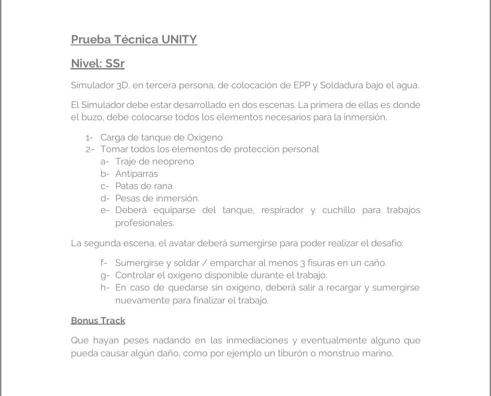

# Prueba Técnica UNITY

**Nivel:** SSr

**Simulador 3D:** Simulador en tercera persona de colocación de EPP y Soldadura bajo el agua.

El simulador debe estar desarrollado en dos escenas:

- La primera de ellas es donde el buzo, debe colocarse todos los elementos necesarios para la inmersión.

## Escena 1: Preparación para la inmersión

1. Carga de tanque de Oxígeno.
2. Tomar todos los elementos de protección personal:
   - Traje de neopreno
   - Antiparras
   - Patas de rana
   - Pesas de inmersión
   - Deberá equiparse del tanque, respirador y cuchillo para trabajos profesionales.

- La segunda escena, el avatar deberá sumergirse para poder realizar el desafío.

## Escena 2: Trabajo bajo el agua

1. Sumergirse y soldar/emparchar al menos 3 fisuras en un caño.
2. Controlar el oxígeno disponible durante el trabajo.
3. En caso de quedarse sin oxígeno, deberá salir a recargar y sumergirse nuevamente para finalizar el trabajo.

## Bonus Track

Que haya peces nadando en las inmediaciones y eventualmente alguno que pueda causar algún daño, como por ejemplo un tiburón o monstruo marino.

Archivo Original:

## Entrega: 15/10/2024

### Aclaraciones:

- ¿Qué debe pasar al completar la simulación (arreglar las fisuras)? ¿Debería haber un "Game Over" y cerrar el juego por código?

`Puedes mostrar una pantalla de resultados que indique cuánto tiempo se tomó para completar la tarea, si se utilizaron los elementos correctos o incorrectos, y cuántas veces el jugador se quedó sin oxígeno.`

- ¿Qué debería ocurrir cuando el jugador es abatido por criaturas marinas o se queda sin oxígeno? ¿Debería empezar de nuevo?

`El jugador debería morir y terminar la simulación.`

- ¿La soldadora tiene algún tipo de batería o es necesario cargarla?

`No, no utilizan baterías. Son equipos que sueldan con gas y alambre bajo el agua, por lo que el jugador debería colocarse una especie de mochila.`

- ¿Es obligatorio ponerse todo el equipo antes de sumergirse? ¿O puede saltar sin las patas de rana y moverse más lento? ¿Y si no lleva las antiparras, debería ver más borroso?

`Es obligatorio utilizar todo el equipo, ya que de lo contrario no cumpliría con las normas de seguridad del trabajo.`

> EPP es elementos de protección personal.